```{r setup}
library(shiny)
library(plotly)

options(
  knitr.table.format = "html",
  scipen = 999,
  shiny.autoreload = TRUE
)
```

# .Cargar paquetes

```{r}
ipak <- function(pkg){

  options(repos = c(CRAN="https://cloud.r-project.org"))

  new.pkg <- pkg[!(pkg %in% rownames(installed.packages()))]

  if(length(new.pkg)) install.packages(new.pkg, dependencies = TRUE)

  invisible(lapply(pkg, function(p)
    suppressPackageStartupMessages(
      library(p, character.only = TRUE)
    )
  ))
}

packages <- c(
  "tidyverse",
  "kableExtra",
  "psych",
  "plotly",
  "shiny"
)

ipak(packages)
```

<br>

# .Introducción modelos continuos

Los modelos continuos de probabilidad permiten describir variables aleatorias que pueden tomar infinitos valores dentro de un intervalo. Estos modelos son fundamentales en estadística para analizar fenómenos como tiempos, pesos, alturas o temperaturas. Mediante funciones de densidad, las distribuciones continuas representan el comportamiento y la variabilidad de los datos, facilitando el análisis e interpretación de situaciones reales bajo incertidumbre.

**Características:**

Los modelos continuos de probabilidad se caracterizan porque las variables aleatorias pueden tomar infinitos valores dentro de un intervalo. Se representan mediante funciones de densidad de probabilidad, donde la probabilidad de un valor exacto es cero y las probabilidades se calculan sobre intervalos. Además, el área total bajo la curva de densidad es igual a 1, lo que permite describir y analizar fenómenos reales como tiempos, pesos, temperaturas y otras mediciones continuas en estadística.

# .Distribuciones Normal

**Ejercicio 6.7:**

Un investigador científico informa que unos ratones vivirán un promedio de 40 meses cuando sus dietas se restringen drásticamente y después se enriquecen con vitaminas y proteínas. Suponiendo que la vidas de tales ratones se distribuyen normalmente con una desviación estándar de 6.3 meses, encuentre la probabilidad de que un ratón dado vivirá:

**A.** más de 32 meses

::: {.callout-tip title="Mostrar solución" collapse="true"}
**Paso 1. Estandarización**

Se utiliza la fórmula:

Sustituyendo los valores:

$\[Z=\frac{32-40}{6.3}\]$

$\[Z=-1.27\]$

Entonces: $\[P(X>32)=P(Z>-1.27)\]$

**Paso 2. Buscar en la tabla normal**

$\[P(Z>-1.27)=0.8980\]$

------------------------------------------------------------------------

**Resultado**

$\[\boxed{P(X>32)=0.8980}\]$

La probabilidad de que un ratón viva más de (32) meses es aproximadamente del:

$89.80\%$
:::

**B.** menos de 28 meses

::: {.callout-tip title="Mostrar solución" collapse="true"}
**Paso 1. Estandarización**

Sustituyendo:

$\[Z=\frac{28-40}{6.3}\]$

$\[Z=-1.90\]$

Entonces:

$\[P(X<28)=P(Z<-1.90)\]$

**Paso 2. Tabla normal**

$\[P(Z<-1.90)=0.0287\]$

------------------------------------------------------------------------

**Resultado**

$\[\boxed{P(X<28)=0.0287}\]$

La probabilidad de que un ratón viva menos de (28) meses es aproximadamente del:

$2.87\%$
:::

------------------------------------------------------------------------

**C.** Entre 37 y 49 meses

::: {.callout-tip title="Mostrar solución" collapse="true"}
Sea:

$\[X \sim N(40,\ 6.3)\]$

Se desea calcular:

$\[P(37<X<49)\]$

**Paso 1. Estandarización**

Para $\(X=37\)$

$\[Z=\frac{37-40}{6.3}\]$

$\[Z=-0.48\]$

Para $\(X=49\)$

$\[Z=\frac{49-40}{6.3}\]$

$\[Z=1.43\]$

Entonces:

$\[P(37<X<49)=P(-0.48<Z<1.43)\]$

**Paso 2. Tabla normal**

$\[P(Z<1.43)=0.9236\]$

$\[P(Z<-0.48)=0.3156\]$

Por tanto:

$\[P(-0.48<Z<1.43)=0.9236-0.3156\]$

$\[=0.6080\]$

------------------------------------------------------------------------

**Resultado**

$\[\boxed{P(37<X<49)=0.6080}\]$

La probabilidad de que un ratón viva entre (37) y (49) meses es aproximadamente del:

$60.80\%$
:::

**Grafica**

## Gráfica interactiva

```{r}
library(shiny)
library(plotly)

sliderInput(
  "a",
  "Valor para P(X > x):",
  min = 10,
  max = 70,
  value = 32
)

sliderInput(
  "b",
  "Valor para P(X < x):",
  min = 10,
  max = 70,
  value = 28
)

sliderInput(
  "c",
  "Intervalo:",
  min = 10,
  max = 70,
  value = c(37,49)
)

plotlyOutput(
  "grafica",
  height = "500px"
)
```

```{r}
#| context: server

library(plotly)

output$grafica <- renderPlotly({

  # Parámetros
  
  mu <- 40
  sigma <- 6.3

  # Datos
  
  x <- seq(10, 70, length.out = 2000)

  y <- dnorm(x, mean = mu, sd = sigma)

  # Probabilidades
  
  pA <- round(
    1 - pnorm(input$a, mu, sigma),
    4
  )

  pB <- round(
    pnorm(input$b, mu, sigma),
    4
  )

  pC <- round(
    pnorm(input$c[2], mu, sigma) -
      pnorm(input$c[1], mu, sigma),
    4
  )

  # Crear gráfica
  
  p <- plot_ly()

  # Curva normal
  
  p <- p %>%
    
    add_lines(
      x = x,
      y = y,
      name = "Distribución Normal",
      line = list(
        color = "darkblue",
        width = 4
      )
    )

  # Área P(X > a)
  
  xa <- x[x >= input$a]
  
  ya <- y[x >= input$a]

  p <- p %>%
    
    add_ribbons(
      x = xa,
      ymin = 0,
      ymax = ya,
      name = paste0(
        "P(X > ",
        input$a,
        ") = ",
        pA
      ),
      fillcolor = "rgba(0,0,255,0.35)",
      line = list(color = "transparent")
    )

  # Área P(X < b)
  
  xb <- x[x <= input$b]
  
  yb <- y[x <= input$b]

  p <- p %>%
    
    add_ribbons(
      x = xb,
      ymin = 0,
      ymax = yb,
      name = paste0(
        "P(X < ",
        input$b,
        ") = ",
        pB
      ),
      fillcolor = "rgba(0,255,0,0.35)",
      line = list(color = "transparent")
    )

  # Área intervalo
  
  xc <- x[
    x >= input$c[1] &
    x <= input$c[2]
  ]

  yc <- y[
    x >= input$c[1] &
    x <= input$c[2]
  ]

  p <- p %>%
    
    add_ribbons(
      x = xc,
      ymin = 0,
      ymax = yc,
      name = paste0(
        "P(",
        input$c[1],
        " < X < ",
        input$c[2],
        ") = ",
        pC
      ),
      fillcolor = "rgba(255,0,0,0.35)",
      line = list(color = "transparent")
    )

  # Líneas verticales
  
  p <- p %>%
    
    add_segments(
      x = input$a,
      xend = input$a,
      y = 0,
      yend = max(y),
      line = list(
        color = "blue",
        dash = "dash"
      ),
      showlegend = FALSE
    )

  p <- p %>%
    
    add_segments(
      x = input$b,
      xend = input$b,
      y = 0,
      yend = max(y),
      line = list(
        color = "green",
        dash = "dash"
      ),
      showlegend = FALSE
    )

  p <- p %>%
    
    add_segments(
      x = input$c[1],
      xend = input$c[1],
      y = 0,
      yend = max(y),
      line = list(
        color = "red",
        dash = "dash"
      ),
      showlegend = FALSE
    )

  p <- p %>%
    
    add_segments(
      x = input$c[2],
      xend = input$c[2],
      y = 0,
      yend = max(y),
      line = list(
        color = "red",
        dash = "dash"
      ),
      showlegend = FALSE
    )

  # Layout final
  
  p %>%
    
    layout(
      title = "Distribución Normal Interactiva",
      
      xaxis = list(
        title = "Meses"
      ),
      
      yaxis = list(
        title = "Densidad"
      ),
      
      hovermode = "closest"
    )

})
```

<br>

**Ejercicio 6.9:**

Una máquina expendedora de bebidas gaseosas se regula para que sirva un promedio de 200 mililitros por vaso. Si la cantidad de bebida se distribuye normalmente con una desviación estándar igual a 15 mililitros.

**A.** ¿qué fracción de los vasos contendrá más de 224 mililitros?

::: {.callout-tip collapse="true"}
## Mostrar solución

Se desea calcular:

$\[P(X>224)\]$

**Estandarización**

$\[Z=\frac{X-\mu}{\sigma}\]$

**Sustituyendo:**

$\[Z=\frac{224-200}{15}\]$

$\[Z=\frac{24}{15}\]$

$\[Z=1.60\]$

**Entonces:**

$\[P(X>224)=P(Z>1.60)\]$

Usando la tabla normal:

$\[P(Z>1.60)=0.0548\]$

**Resultado**

$\[\boxed{P(X>224)=0.0548}\]$

La probabilidad de que un vaso contenga más de 224 mililitros es aproximadamente del:

$5.48\%$
:::

**B.** ¿cuál es la probabilidad de que un vaso contenga entre 191 y 209 mililitros?

::: {.callout-tip collapse="true"}
## Mostrar solución

Se desea calcular:

\[P(191\<X\<209)\]

**Estandarización del límite inferior**

$\[Z_1=\frac{191-200}{15}\]$

$\[Z_1=\frac{-9}{15}\]$

$\[Z_1=-0.60\]$

**Estandarización del límite superior**

$\[Z_2=\frac{209-200}{15}\]$

$\[Z_2=\frac{9}{15}\]$

$\[Z_2=0.60\]$

Entonces:

$\[P(191<X<209)=P(-0.60<Z<0.60)\]$

Usando la tabla normal:

$\[P(Z<0.60)=0.7257\]$

$\[P(Z<-0.60)=0.2743\]$

$\[P(-0.60<Z<0.60)=0.7257-0.2743\]$

$\[P(-0.60<Z<0.60)=0.4514\]$

**Resultado**

$\[\boxed{P(191<X<209)=0.4514}\]$

La probabilidad de que un vaso contenga entre 191 y 209 mililitros es aproximadamente del:

$\boxed{45.14\%}$
:::

------------------------------------------------------------------------

**C.** ¿cuántos vasos probablemente se derramarán si se utilizan vasos de 230 mililitros para las siguientes 1000 bebidas?

::: {.callout-tip collapse="true"}
## Mostrar solución

La capacidad del vaso es:

$\[230 \text{ ml}\]$

Se desea calcular:

$\[P(X>230)\]$

**Estandarización**

$\[Z=\frac{230-200}{15}\]$

$\[Z=\frac{30}{15}\]$

$\[Z=2\]$

Entonces:

$\[P(X>230)=P(Z>2)\]$

Usando la tabla normal:

$\[P(Z>2)=0.0228\]$

Ahora calculamos cuántos vasos se derramarán en 1000 bebidas:

$\[1000(0.0228)=22.8\]$

**Resultado**

$\[\boxed{23 \text{ vasos aproximadamente}}\]$

Probablemente se derramarán aproximadamente:

$\boxed{23 \text{ vasos}}$
:::

**Grafica**

## Gráfica interactiva

```{r}
library(shiny)
library(plotly)

sliderInput(
  "a_bebidas",
  "A. Valor para P(X > x):",
  min = 150,
  max = 260,
  value = 224
)

sliderInput(
  "b_bebidas",
  "B. Intervalo para P(a < X < b):",
  min = 150,
  max = 260,
  value = c(191,209)
)

sliderInput(
  "c_bebidas",
  "C. Capacidad del vaso:",
  min = 150,
  max = 260,
  value = 230
)

plotlyOutput(
  "grafica_bebidas",
  height = "500px"
)
```

```{r}
#| context: server

library(plotly)

output$grafica_bebidas <- renderPlotly({

  # Parámetros
  
  mu <- 200
  sigma <- 15

  # Datos
  
  x <- seq(140, 270, length.out = 3000)

  y <- dnorm(
    x,
    mean = mu,
    sd = sigma
  )

  # Probabilidades
  
  pA <- round(
    1 - pnorm(input$a_bebidas, mu, sigma),
    4
  )

  pB <- round(
    pnorm(input$b_bebidas[2], mu, sigma) -
      pnorm(input$b_bebidas[1], mu, sigma),
    4
  )

  pC <- round(
    1 - pnorm(input$c_bebidas, mu, sigma),
    4
  )

  vasos <- round(
    1000 * pC
  )

  # Crear gráfica
  
  p <- plot_ly()

  # Curva normal
  
  p <- p %>%
    
    add_lines(
      x = x,
      y = y,
      
      name = "Distribución Normal",
      
      line = list(
        color = "darkblue",
        width = 4
      )
    )

  # Área A
  
  xa <- x[x >= input$a_bebidas]
  
  ya <- y[x >= input$a_bebidas]

  p <- p %>%
    
    add_ribbons(
      x = xa,
      ymin = 0,
      ymax = ya,
      
      name = paste0(
        "A) P(X > ",
        input$a_bebidas,
        ") = ",
        pA
      ),
      
      fillcolor = "rgba(0,0,255,0.35)",
      
      line = list(
        color = "transparent"
      )
    )

  # Área B
  
  xb <- x[
    x >= input$b_bebidas[1] &
      x <= input$b_bebidas[2]
  ]

  yb <- y[
    x >= input$b_bebidas[1] &
      x <= input$b_bebidas[2]
  ]

  p <- p %>%
    
    add_ribbons(
      x = xb,
      ymin = 0,
      ymax = yb,
      
      name = paste0(
        "B) P(",
        input$b_bebidas[1],
        " < X < ",
        input$b_bebidas[2],
        ") = ",
        pB
      ),
      
      fillcolor = "rgba(0,255,0,0.35)",
      
      line = list(
        color = "transparent"
      )
    )

  # Área C
  
  xc <- x[x >= input$c_bebidas]
  
  yc <- y[x >= input$c_bebidas]

  p <- p %>%
    
    add_ribbons(
      x = xc,
      ymin = 0,
      ymax = yc,
      
      name = paste0(
        "C) P(X > ",
        input$c_bebidas,
        ") = ",
        pC,
        " → ",
        vasos,
        " vasos"
      ),
      
      fillcolor = "rgba(255,0,0,0.35)",
      
      line = list(
        color = "transparent"
      )
    )

  # Líneas verticales
  
  p <- p %>%
    
    add_segments(
      x = input$a_bebidas,
      xend = input$a_bebidas,
      y = 0,
      yend = max(y),
      
      line = list(
        color = "blue",
        dash = "dash"
      ),
      
      showlegend = FALSE
    )

  p <- p %>%
    
    add_segments(
      x = input$b_bebidas[1],
      xend = input$b_bebidas[1],
      y = 0,
      yend = max(y),
      
      line = list(
        color = "green",
        dash = "dash"
      ),
      
      showlegend = FALSE
    )

  p <- p %>%
    
    add_segments(
      x = input$b_bebidas[2],
      xend = input$b_bebidas[2],
      y = 0,
      yend = max(y),
      
      line = list(
        color = "green",
        dash = "dash"
      ),
      
      showlegend = FALSE
    )

  p <- p %>%
    
    add_segments(
      x = input$c_bebidas,
      xend = input$c_bebidas,
      y = 0,
      yend = max(y),
      
      line = list(
        color = "red",
        dash = "dash"
      ),
      
      showlegend = FALSE
    )

  # Layout final
  
  p %>%
    
    layout(
      
      title = "Distribución Normal - Bebidas Gaseosas",
      
      xaxis = list(
        title = "Mililitros"
      ),
      
      yaxis = list(
        title = "Densidad"
      ),
      
      hovermode = "closest"
    )

})
```

<br>

**Ejercicio 6.11**

Un abogado viaja todos los días de su casa en los suburbios a su ofi cina en el centro de la ciudad. El tiempo promedio para un viaje sólo de ida es 24 minutos, con una desviación estándar de 3.8 minutos. Suponga que la distribución de los tiempos de viaje está distribuida normalmente.

**A.** ¿Cuál es la probabilidad de que un viaje tome al menos 1/2 hora?

::: {.callout-tip collapse="true"}
## Mostrar solución

Sea:

$\[X \sim N(24,3.8)\]$

Se desea calcular:

$\[P(X>30)\]$

**Estandarización**

$\[Z=\frac{X-\mu}{\sigma}\]$

**Sustituyendo:**

$\[Z=\frac{30-24}{3.8}\]$

$\[Z=\frac{6}{3.8}\]$

$\[Z=1.58\]$

Entonces:

$\[P(X>30)=P(Z>1.58)\]$

Usando la tabla normal:

$\[P(Z>1.58)=0.0571\]$

**Resultado**

$\[\boxed{P(X>30)=0.0571}\]$

La probabilidad de que un viaje tome al menos 30 minutos es aproximadamente del:

$\boxed{5.71\%}$
:::

------------------------------------------------------------------------

**B.** Si la oficina abre a las 9:00 A.M. y él sale diario de su casa a las 8:45 A.M., ¿qué porcentaje de las veces llegará tarde al trabajo?

::: {.callout-tip collapse="true"}
## Mostrar solución

La oficina abre a las:

$\[9:00\ \text{A.M.}\]$

El abogado sale de su casa a las:

$\[8:45\ \text{A.M.}\]$

Por tanto, dispone de:

$\[15\ \text{minutos}\]$

Se desea calcular:

$\[P(X>15)\]$

**Estandarización**

$\[Z=\frac{15-24}{3.8}\]$

$\[Z=\frac{-9}{3.8}\]$

$\[Z=-2.37\]$

Entonces:

$\[P(X>15)=P(Z>-2.37)\]$

Usando la tabla normal:

$\[P(Z>-2.37)=0.9911\]$

**Resultado**

$\[\boxed{P(X>15)=0.9911}\]$

El abogado llegará tarde aproximadamente el:

$\boxed{99.11\%}$

de las veces.
:::

------------------------------------------------------------------------

**C.** Si sale de su casa a las 8:35 A.M. y el café se sirve en la oficina de 8:50 A.M. a 9:00 A.M., cuál es la probabilidad de que se pierda el café?

::: {.callout-tip collapse="true"}
## Mostrar solución

El café se sirve entre:

$\[8:50\ \text{A.M. y}\ 9:00\ \text{A.M.}\]$

El abogado sale a las:

$\[8:35\ \text{A.M.}\]$

Para perderse el café debe tardar más de:

$\[15\ \text{minutos}\]$

Se desea calcular:

$\[P(X>15)\]$

**Estandarización**

$\[Z=\frac{15-24}{3.8}\]$

$\[Z=-2.37\]$

Entonces:

$\[P(X>15)=P(Z>-2.37)\]$

Usando la tabla normal:

$\[P(Z>-2.37)=0.9911\]$

**Resultado**

$\[\boxed{P(X>15)=0.9911}\]$

La probabilidad de perderse el café es aproximadamente del:

$\boxed{99.11\%}$
:::

------------------------------------------------------------------------

**D.** Encuentre la longitud de tiempo por arriba de la cual encontramos e1 15% de los viajes más lentos.

::: {.callout-tip collapse="true"}
## Mostrar solución

Se desea encontrar el valor de:

$\[x\]$

tal que:

$\[P(X>x)=0.15\]$

Entonces:

$\[P(X<x)=0.85\]$

Buscando en la tabla normal:

$\[Z=1.04\]$

Usamos la fórmula:

$\[X=\mu+Z\sigma\]$

Sustituyendo:

$\[X=24+(1.04)(3.8)\]$

$\[X=24+3.95\]$

$\[X=27.95\]$

**Resultado**

$\[\boxed{X\approx27.95\ \text{minutos}}\]$

El 15% de los viajes más lentos duran más de aproximadamente:
:::

------------------------------------------------------------------------

**E.** Encuentre la probabilidad de que 2 de los siguientes 3 viajes tomen al menos 1/2 hora.

::: {.callout-tip collapse="true"}
## Mostrar solución

De la parte A:

$\[P(X>30)=0.0571\]$

Entonces:

$\[p=0.0571\]$

El problema sigue una distribución binomial:

$\[X\sim Bin(n=3,p=0.0571)\]$

Se desea calcular:

$\[P(X=2)\]$

Usamos la fórmula binomial:

$\[P(X=x)=\binom{n}{x}p^x(1-p)^{n-x}\]$

Sustituyendo:

$\[P(X=2)=\binom{3}{2}(0.0571)^2(1-0.0571)^1\]$

$\[P(X=2)=3(0.00326)(0.9429)\]$

$\[P(X=2)=0.0092\]$

Resultado

$\[\boxed{P(X=2)=0.0092}\]$

La probabilidad de que exactamente 2 de los siguientes 3 viajes tomen al menos 30 minutos es aproximadamente del:

$\[\boxed{0.92\%}\]$
:::

**Grafica**

## Gráfica interactiva

```{r}
library(shiny)
library(plotly)

sliderInput(
  "a_abogado",
  "A. Valor para P(X > x):",
  min = 5,
  max = 50,
  value = 30
)

sliderInput(
  "b_abogado",
  "B. Tiempo límite para llegar al trabajo:",
  min = 5,
  max = 50,
  value = 15
)

sliderInput(
  "c_abogado",
  "C. Tiempo máximo para alcanzar el café:",
  min = 5,
  max = 50,
  value = 15
)

sliderInput(
  "d_abogado",
  "D. Percentil viajes más lentos (%):",
  min = 1,
  max = 50,
  value = 15
)

plotlyOutput(
  "grafica_abogado",
  height = "500px"
)
```

```{r}
#| context: server

library(plotly)

output$grafica_abogado <- renderPlotly({

  # Parámetros
  
  mu <- 24
  sigma <- 3.8

  # Datos
  
  x <- seq(5, 50, length.out = 3000)

  y <- dnorm(
    x,
    mean = mu,
    sd = sigma
  )

  # Probabilidades
  
  pA <- round(
    1 - pnorm(input$a_abogado, mu, sigma),
    4
  )

  pB <- round(
    1 - pnorm(input$b_abogado, mu, sigma),
    4
  )

  pC <- round(
    1 - pnorm(input$c_abogado, mu, sigma),
    4
  )

  # Percentil D
  
  percentil <- round(
    qnorm(
      1 - (input$d_abogado / 100),
      mean = mu,
      sd = sigma
    ),
    2
  )

  # Probabilidad binomial E
  
  p30 <- 1 - pnorm(30, mu, sigma)

  pE <- round(
    dbinom(
      2,
      size = 3,
      prob = p30
    ),
    4
  )

  # Crear gráfica
  
  p <- plot_ly()

  # Curva normal
  
  p <- p %>%
    
    add_lines(
      x = x,
      y = y,
      
      name = "Distribución Normal",
      
      line = list(
        color = "darkblue",
        width = 4
      )
    )

  # Área A
  
  xa <- x[x >= input$a_abogado]
  
  ya <- y[x >= input$a_abogado]

  p <- p %>%
    
    add_ribbons(
      x = xa,
      ymin = 0,
      ymax = ya,
      
      name = paste0(
        "A) P(X > ",
        input$a_abogado,
        ") = ",
        pA
      ),
      
      fillcolor = "rgba(0,0,255,0.35)",
      
      line = list(
        color = "transparent"
      )
    )

  # Área B
  
  xb <- x[x >= input$b_abogado]
  
  yb <- y[x >= input$b_abogado]

  p <- p %>%
    
    add_ribbons(
      x = xb,
      ymin = 0,
      ymax = yb,
      
      name = paste0(
        "B) Llegar tarde = ",
        pB
      ),
      
      fillcolor = "rgba(0,255,0,0.35)",
      
      line = list(
        color = "transparent"
      )
    )

  # Área C
  
  xc <- x[x >= input$c_abogado]
  
  yc <- y[x >= input$c_abogado]

  p <- p %>%
    
    add_ribbons(
      x = xc,
      ymin = 0,
      ymax = yc,
      
      name = paste0(
        "C) Perder el café = ",
        pC
      ),
      
      fillcolor = "rgba(255,0,0,0.35)",
      
      line = list(
        color = "transparent"
      )
    )

  # Línea percentil D
  
  p <- p %>%
    
    add_segments(
      x = percentil,
      xend = percentil,
      y = 0,
      yend = max(y),
      
      line = list(
        color = "orange",
        dash = "dash"
      ),
      
      name = paste0(
        "D) 15% más lentos = ",
        percentil,
        " min"
      )
    )

  # Líneas verticales
  
  p <- p %>%
    
    add_segments(
      x = input$a_abogado,
      xend = input$a_abogado,
      y = 0,
      yend = max(y),
      
      line = list(
        color = "blue",
        dash = "dash"
      ),
      
      showlegend = FALSE
    )

  p <- p %>%
    
    add_segments(
      x = input$b_abogado,
      xend = input$b_abogado,
      y = 0,
      yend = max(y),
      
      line = list(
        color = "green",
        dash = "dash"
      ),
      
      showlegend = FALSE
    )

  p <- p %>%
    
    add_segments(
      x = input$c_abogado,
      xend = input$c_abogado,
      y = 0,
      yend = max(y),
      
      line = list(
        color = "red",
        dash = "dash"
      ),
      
      showlegend = FALSE
    )

  # Layout final
  
  p %>%
    
    layout(
      
      title = paste0(
        "Distribución Normal - Tiempo de Viaje",
        "<br>",
        "E) P(2 de 3 viajes > 30 min) = ",
        pE
      ),
      
      xaxis = list(
        title = "Tiempo (minutos)"
      ),
      
      yaxis = list(
        title = "Densidad"
      ),
      
      hovermode = "closest"
    )

})
```

<br>

**Ejercicio 6.13**

La vida promedio de cierto tipo de motor pequeño es de 10 años con una desviación estándar de 2 años. El fabricante reemplaza gratis todos los motores que fallen dentro del periodo de garantía. Si él está dispuesto a reemplazar sólo 3% de los motores que fallan.

**A.** ¿Cuánto tiempo de garantía debería ofrecer? Suponga que la duración de un motor sigue una distribución normal.?

::: {.callout-tip collapse="true"}
## Mostrar solución

Sea:

$\[X \sim N(10,2)\]$

donde:

**Media:**

$\[\mu = 10\]$

**Desviación estándar:**

$\[\sigma = 2\]$

El fabricante desea reemplazar solamente el:

$\[3\%\]$

de los motores.

Entonces se busca el valor de:

$\[x\]$

tal que:

$\[P(X<x)=0.03\]$

------------------------------------------------------------------------

**Encontrar el valor crítico Z**

Buscando en la tabla normal:

$\[P(Z<z)=0.03\]$

**obtenemos:**

$\[Z=-1.88\]$

------------------------------------------------------------------------

**Aplicando la fórmula de estandarización**

$\[Z=\frac{X-\mu}{\sigma}\]$

Sustituyendo:

$\[-1.88=\frac{X-10}{2}\]$

Multiplicando por 2:

$\[-3.76=X-10\]$

Despejando:

\[X=10-3.76\]

$\[X=6.24\]$

------------------------------------------------------------------------

**Resultado**

$\[\boxed{X\approx6.24\ \text{años}}\]$

El fabricante debería ofrecer aproximadamente una garantía de:

$\[\boxed{6.24\ \text{años}}\]$

para reemplazar solamente el $(3\%)$ de los motores que fallen.
:::

**Grafica**

## Gráfica interactiva

```{r}
library(shiny)
library(plotly)

sliderInput(
  "garantia_motor",
  "Tiempo de garantía (años):",
  min = 1,
  max = 15,
  value = 6.24,
  step = 0.01
)

plotlyOutput(
  "grafica_motor",
  height = "500px"
)
```

```{r}
#| context: server

library(plotly)

output$grafica_motor <- renderPlotly({

  # Parámetros
  
  mu <- 10
  sigma <- 2

  # Datos
  
  x <- seq(0, 20, length.out = 3000)

  y <- dnorm(
    x,
    mean = mu,
    sd = sigma
  )

  # Probabilidad
  
  p <- round(
    pnorm(
      input$garantia_motor,
      mean = mu,
      sd = sigma
    ),
    4
  )

  # Crear gráfica
  
  g <- plot_ly()

  # Curva normal
  
  g <- g %>%
    
    add_lines(
      x = x,
      y = y,
      
      name = "Distribución Normal",
      
      line = list(
        color = "darkblue",
        width = 4
      )
    )

  # Área de garantía
  
  xg <- x[
    x <= input$garantia_motor
  ]

  yg <- y[
    x <= input$garantia_motor
  ]

  g <- g %>%
    
    add_ribbons(
      x = xg,
      ymin = 0,
      ymax = yg,
      
      name = paste0(
        "P(X < ",
        round(input$garantia_motor,2),
        ") = ",
        p
      ),
      
      fillcolor = "rgba(255,0,0,0.35)",
      
      line = list(
        color = "transparent"
      )
    )

  # Línea vertical
  
  g <- g %>%
    
    add_segments(
      x = input$garantia_motor,
      xend = input$garantia_motor,
      y = 0,
      yend = max(y),
      
      line = list(
        color = "red",
        dash = "dash"
      ),
      
      showlegend = FALSE
    )

  # Layout final
  
  g %>%
    
    layout(
      
      title = paste0(
        "Distribución Normal - Garantía de Motores",
        "<br>",
        "Probabilidad de reemplazo = ",
        p * 100,
        "%"
      ),
      
      xaxis = list(
        title = "Tiempo de duración (años)"
      ),
      
      yaxis = list(
        title = "Densidad"
      ),
      
      hovermode = "closest"
    )

})
```

<br>

**Ejercicio 6.15**

Una compañía paga a sus empleados un salario promedio de \$15.90 por hora con una desviación estándar de \$1.50. Si los salarios se distribuyen aproximadamentede forma normal y se pagan al centavo más 6.15

**A.** ¿qué porcentaje de los trabajadores reciben salarios entre \$13.75 y \$16.22 inclusive por hora?

::: {.callout-tip collapse="true"}
## Mostrar solución

Sea:

$\[X \sim N(15.90,1.50)\]$

donde:

**Media:**

$\[\mu = 15.90\]$

**Desviación estándar:**

$\[\sigma = 1.50\]$

Se desea calcular:

$\[P(13.75<X<16.22)\]$

------------------------------------------------------------------------

**Estandarización del límite inferior**

$\[Z_1=\frac{13.75-15.90}{1.50}\]$

$\[Z_1=\frac{-2.15}{1.50}\]$

$\[Z_1=-1.43\]$

------------------------------------------------------------------------

**Estandarización del límite superior**

$\[Z_2=\frac{16.22-15.90}{1.50}\]$

$\[Z_2=\frac{0.32}{1.50}\]$

$\[Z_2=0.21\]$

Entonces:

$\[P(13.75<X<16.22)=P(-1.43<Z<0.21)\]$

Usando la tabla normal:

$\[P(Z<0.21)=0.5832\]$

$\[P(Z<-1.43)=0.0764\]$

Por tanto:

$\[P(-1.43<Z<0.21)=0.5832-0.0764\]$

$\[P(-1.43<Z<0.21)=0.5068\]$

------------------------------------------------------------------------

**Resultado**

$\[\boxed{P(13.75<X<16.22)=0.5068}\]$

La probabilidad de que un trabajador reciba entre \$13.75 y \$16.22 por hora es aproximadamente del:

$\boxed{50.68\%}$
:::

------------------------------------------------------------------------

**B.** ¿el 5% más alto de los salarios por hora de los empleados es mayor a qué cantidad?

::: {.callout-tip collapse="true"}
## Mostrar solución

Se desea encontrar el valor de:

$\[x\]$

tal que:

$\[P(X>x)=0.05\]$

Entonces:

$\[P(X<x)=0.95\]$

Buscando en la tabla normal:

$\[Z=1.645\]$

Usamos la fórmula:

$\[X=\mu+Z\sigma\]$

Sustituyendo:

$\[X=15.90+(1.645)(1.50)\]$

$\[X=15.90+2.47\]$

$\[X=18.37\]$

------------------------------------------------------------------------

**Resultado**

$\[\boxed{X\approx18.37}\]$

El 5% más alto de los salarios por hora corresponde a salarios mayores que:

$\[\boxed{\$18.37\ \text{por hora}}\]$
:::

------------------------------------------------------------------------

**Gráfica**

## Gráfica interactiva

```{r}
library(shiny)
library(plotly)

sliderInput(
  "salario_inf",
  "Límite inferior:",
  min = 10,
  max = 25,
  value = 13.75,
  step = 0.01
)

sliderInput(
  "salario_sup",
  "Límite superior:",
  min = 10,
  max = 25,
  value = 16.22,
  step = 0.01
)

sliderInput(
  "top5",
  "Percentil del salario más alto (%):",
  min = 1,
  max = 20,
  value = 5
)

plotlyOutput(
  "grafica_salarios",
  height = "500px"
)
```

```{r}
#| context: server

library(plotly)

output$grafica_salarios <- renderPlotly({

  # Parámetros
  
  mu <- 15.90
  sigma <- 1.50

  # Datos
  
  x <- seq(10, 25, length.out = 3000)

  y <- dnorm(
    x,
    mean = mu,
    sd = sigma
  )

  # Probabilidad A
  
  pA <- round(
    pnorm(input$salario_sup, mu, sigma) -
      pnorm(input$salario_inf, mu, sigma),
    4
  )

  # Percentil B
  
  salario_top <- round(
    qnorm(
      1 - (input$top5 / 100),
      mean = mu,
      sd = sigma
    ),
    2
  )

  # Crear gráfica
  
  p <- plot_ly()

  # Curva normal
  
  p <- p %>%
    
    add_lines(
      x = x,
      y = y,
      
      name = "Distribución Normal",
      
      line = list(
        color = "darkblue",
        width = 4
      )
    )

  # Área intervalo
  
  xa <- x[
    x >= input$salario_inf &
      x <= input$salario_sup
  ]

  ya <- y[
    x >= input$salario_inf &
      x <= input$salario_sup
  ]

  p <- p %>%
    
    add_ribbons(
      x = xa,
      ymin = 0,
      ymax = ya,
      
      name = paste0(
        "P(",
        input$salario_inf,
        " < X < ",
        input$salario_sup,
        ") = ",
        pA
      ),
      
      fillcolor = "rgba(0,0,255,0.35)",
      
      line = list(
        color = "transparent"
      )
    )

  # Línea percentil
  
  p <- p %>%
    
    add_segments(
      x = salario_top,
      xend = salario_top,
      y = 0,
      yend = max(y),
      
      line = list(
        color = "red",
        dash = "dash"
      ),
      
      name = paste0(
        "Top ",
        input$top5,
        "% = $",
        salario_top
      )
    )

  # Líneas verticales
  
  p <- p %>%
    
    add_segments(
      x = input$salario_inf,
      xend = input$salario_inf,
      y = 0,
      yend = max(y),
      
      line = list(
        color = "blue",
        dash = "dash"
      ),
      
      showlegend = FALSE
    )

  p <- p %>%
    
    add_segments(
      x = input$salario_sup,
      xend = input$salario_sup,
      y = 0,
      yend = max(y),
      
      line = list(
        color = "blue",
        dash = "dash"
      ),
      
      showlegend = FALSE
    )

  # Layout final
  
  p %>%
    
    layout(
      
      title = "Distribución Normal - Salarios por Hora",
      
      xaxis = list(
        title = "Salario por hora ($)"
      ),
      
      yaxis = list(
        title = "Densidad"
      ),
      
      hovermode = "closest"
    )

})
```

<br>

# .Distribucion Ji Cuadrado

**Ejercicio 8.39**

Para una distribución si es cuadrada encuentre

**A.** 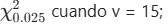

::: {.callout-tip collapse="true"}
## Mostrar solución inciso a

Se desea encontrar el valor crítico de la distribución chi-cuadrada:

$$\chi^2_{0.025} \quad \text{cuando } v = 15$$

Esto significa que buscamos el valor que deja un área de $0.025$ a la derecha con $15$ grados de libertad:

$$P(X > \chi^2_{0.025}) = 0.025$$

Buscando en la tabla de la distribución chi-cuadrada en la fila $v = 15$ y la columna $\alpha = 0.025$:

$$\chi^2_{0.025} = 27.488$$

------------------------------------------------------------------------

**Resultado**

$$\boxed{\chi^2 = 27.488}$$

El valor de la distribución chi-cuadrada para estas condiciones es $27.488$.
:::

**B.** 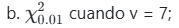

::: {.callout-tip collapse="true"}
## Mostrar solución inciso b

Se desea encontrar el valor crítico de la distribución chi-cuadrada:

$$\chi^2_{0.01} \quad \text{cuando } v = 7$$

Esto significa que buscamos el valor que deja un área de $0.01$ a la derecha con $7$ grados de libertad:

$$P(X > \chi^2_{0.01}) = 0.01$$

Buscando en la tabla de la distribución chi-cuadrada en la fila $v = 7$ y la columna $\alpha = 0.01$:

$$\chi^2_{0.01} = 18.475$$

------------------------------------------------------------------------

**Resultado**

$$\boxed{\chi^2 = 18.475}$$

El valor de la distribución chi-cuadrada para estas condiciones es $18.475$.
:::

**C.** 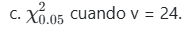

::: {.callout-tip collapse="true"}
## Mostrar solución inciso c

Se desea encontrar el valor crítico de la distribución chi-cuadrada:

$$\chi^2_{0.05} \quad \text{cuando } v = 24$$

Esto significa que buscamos el valor que deja un área de $0.05$ a la derecha con $24$ grados de libertad:

$$P(X > \chi^2_{0.05}) = 0.05$$

Buscando en la tabla de la distribución chi-cuadrada en la fila $v = 24$ y la columna $\alpha = 0.05$:

$$\chi^2_{0.05} = 36.415$$

------------------------------------------------------------------------

**Resultado**

$$\boxed{\chi^2 = 36.415}$$

El valor de la distribución chi-cuadrada para estas condiciones es $36.415$.
:::

**Gráfica**

## Gráfica Interactiva

```{r}
library(shiny)
library(plotly)

# Panel de controles en paralelo para las tres curvas
fluidRow(
  column(4,
    sliderInput(
      "v_curva1",
      "Grados de Libertad - Curva 1 (Roja):",
      min = 2, max = 35, value = 4, step = 1
    )
  ),
  column(4,
    sliderInput(
      "v_curva2",
      "Grados de Libertad - Curva 2 (Verde):",
      min = 2, max = 35, value = 5, step = 1
    )
  ),
  column(4,
    sliderInput(
      "v_curva3",
      "Grados de Libertad - Curva 3 (Azul):",
      min = 2, max = 35, value = 10, step = 1
    )
  )
)

plotlyOutput(
  "grafica_triple_interactiva",
  height = "550px"
)
```

```{r}
#| context: server

library(plotly)

output$grafica_triple_interactiva <- renderPlotly({

  # Captura de los valores independientes de los sliders
  v1 <- input$v_curva1
  v2 <- input$v_curva2
  v3 <- input$v_curva3

  # Eje X común adaptado al rango de la imagen original
  x <- seq(0, 45, length.out = 1000)
  
  # Cálculo de las densidades matemáticas para cada valor seleccionado
  y1 <- dchisq(x, df = v1)
  y2 <- dchisq(x, df = v2)
  y3 <- dchisq(x, df = v3)

  # Construcción del lienzo con Plotly
  p <- plot_ly()

  # CURVA 1: Configuración de color rojo/salmón
  p <- p %>%
    add_lines(
      x = x, y = y1,
      name = paste0("Curva 1 (v = ", v1, ")"),
      line = list(color = "#f8766d", width = 3.5)
    )

  # CURVA 2: Configuración de color verde
  p <- p %>%
    add_lines(
      x = x, y = y2,
      name = paste0("Curva 2 (v = ", v2, ")"),
      line = list(color = "#00ba38", width = 3.5)
    )

  # CURVA 3: Configuración de color azul
  p <- p %>%
    add_lines(
      x = x, y = y3,
      name = paste0("Curva 3 (v = ", v3, ")"),
      line = list(color = "#619cff", width = 3.5)
    )

  # Estética y diseño del entorno idéntico a la imagen de referencia (Estilo R/ggplot2)
  p %>%
    layout(
      title = list(
        text = "<b>Familia de curvas X² Interactiva</b><br>Modifica los sliders superiores para transformar cada densidad"
      ),
      xaxis = list(
        title = "x",
        range = c(0, 40),
        gridcolor = "#eaeaea",
        zeroline = FALSE
      ),
      yaxis = list(
        title = "Densidad",
        range = c(0, 0.22),
        gridcolor = "#eaeaea",
        zeroline = FALSE
      ),
      plot_bgcolor = "white",
      paper_bgcolor = "white",
      legend = list(
        title = list(text = "<b>Grados de libertad (k)</b>"),
        y = 0.5
      ),
      hovermode = "x unified" # Muestra los valores de las 3 curvas simultáneamente al pasar el cursor
    )
})
```

<br>

**Ejercicio 8.41**

Para una distribución chi cuadrada encuentre

**A.** 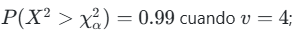

::: {.callout-tip collapse="true"}
## Mostrar solución inciso a

Se desea encontrar el valor crítico $\chi_{\alpha}^2$ tal que:

$$P(X^2 > \chi_{\alpha}^2) = 0.99 \quad \text{cuando } v = 4$$

En la tabla tradicional chi-cuadrada de cola derecha, buscamos el área correspondientes a $\alpha = 0.99$ con un grado de libertad $v = 4$:

$$\chi_{0.99}^2 = 0.297$$

------------------------------------------------------------------------

**Resultado**

$$\boxed{\chi_{\alpha}^2 = 0.297}$$
:::

**B.** 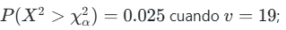

::: {.callout-tip collapse="true"}
## Mostrar solución inciso b

Se desea encontrar el valor crítico $\chi_{\alpha}^2$ tal que:

$$P(X^2 > \chi_{\alpha}^2) = 0.025 \quad \text{cuando } v = 19$$

Buscamos directamente en la tabla chi-cuadrada el área de la cola derecha $\alpha = 0.025$ con grados de libertad $v = 19$:

$$\chi_{0.025}^2 = 32.852$$

------------------------------------------------------------------------

**Resultado**

$$\boxed{\chi_{\alpha}^2 = 32.852}$$
:::

**C.** 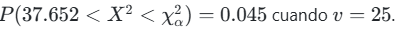

::: {.callout-tip collapse="true"}
## Mostrar solución inciso c

Se desea encontrar el valor crítico $\chi_{\alpha}^2$ tal que:

$$P(37.652 < X^2 < \chi_{\alpha}^2) = 0.045 \quad \text{cuando } v = 25$$

Primero, buscamos en la tabla de cola derecha qué área le corresponde al valor conocido $37.652$ con $v = 25$:

$$P(X^2 > 37.652) = 0.05$$

Sabemos que la probabilidad del intervalo se puede descomponer como:

$$P(37.652 < X^2 < \chi_{\alpha}^2) = P(X^2 > 37.652) - P(X^2 > \chi_{\alpha}^2)$$

Sustituyendo los valores conocidos:

$$0.045 = 0.05 - P(X^2 > \chi_{\alpha}^2)$$

$$P(X^2 > \chi_{\alpha}^2) = 0.05 - 0.045 = 0.005$$

Por lo tanto, buscamos el valor crítico en la tabla para un área a la derecha de $\alpha = 0.005$ con $v = 25$:

$$\chi_{0.005}^2 = 46.928$$

------------------------------------------------------------------------

**Resultado**

$$\boxed{\chi_{\alpha}^2 = 46.928}$$
:::

<br>

**Grafica**

## Gráfica Interactiva

```{r}
library(shiny)
library(plotly)

# Panel de controles independientes adaptado al Ejercicio 8.41
fluidRow(
  column(4,
    sliderInput(
      "v_ej2_c1",
      "Grados de Libertad - Curva 1 (Inciso a):",
      min = 1, max = 40, value = 4, step = 1
    )
  ),
  column(4,
    sliderInput(
      "v_ej2_c2",
      "Grados de Libertad - Curva 2 (Inciso b):",
      min = 1, max = 40, value = 19, step = 1
    )
  ),
  column(4,
    sliderInput(
      "v_ej2_c3",
      "Grados de Libertad - Curva 3 (Inciso c):",
      min = 1, max = 40, value = 25, step = 1
    )
  )
)

plotlyOutput(
  "grafica_triple_ejercicio841",
  height = "550px"
)
```

```{r}
#| context: server

library(plotly)

output$grafica_triple_ejercicio841 <- renderPlotly({

  # Captura de los valores de los sliders interactivos
  v1 <- input$v_ej2_c1
  v2 <- input$v_ej2_c2
  v3 <- input$v_ej2_c3

  # Eje X común ajustado para mostrar la dispersión de hasta v = 40
  x <- seq(0, 60, length.out = 1200)
  
  # Cálculo de las funciones de densidad correspondientes
  y1 <- dchisq(x, df = v1)
  y2 <- dchisq(x, df = v2)
  y3 <- dchisq(x, df = v3)

  p <- plot_ly()

  # Curva 1 (Estilo Inciso a - Inicialmente v=4)
  p <- p %>%
    add_lines(
      x = x, y = y1,
      name = paste0("Curva 1 (v = ", v1, ")"),
      line = list(color = "#f8766d", width = 3.5)
    )

  # Curva 2 (Estilo Inciso b - Inicialmente v=19)
  p <- p %>%
    add_lines(
      x = x, y = y2,
      name = paste0("Curva 2 (v = ", v2, ")"),
      line = list(color = "#00ba38", width = 3.5)
    )

  # Curva 3 (Estilo Inciso c - Inicialmente v=25)
  p <- p %>%
    add_lines(
      x = x, y = y3,
      name = paste0("Curva 3 (v = ", v3, ")"),
      line = list(color = "#619cff", width = 3.5)
    )

  # Diseño de fondo y formato idéntico a tus imágenes guía
  p %>%
    layout(
      title = list(
        text = "<b>Familia de curvas X² Interactiva - Ejercicio 8.41</b><br>Modifica los parámetros para alterar las 3 curvas en tiempo real"
      ),
      xaxis = list(
        title = "x",
        range = c(0, 55),
        gridcolor = "#eaeaea",
        zeroline = FALSE
      ),
      yaxis = list(
        title = "Densidad",
        range = c(0, 0.22),
        gridcolor = "#eaeaea",
        zeroline = FALSE
      ),
      plot_bgcolor = "white",
      paper_bgcolor = "white",
      legend = list(
        title = list(text = "<b>Grados de libertad (k)</b>"),
        y = 0.5
      ),
      hovermode = "x unified"
    )
})
```

<br>

# .Distribucion T de Student

**Ejercicio 8.47**

**A.** 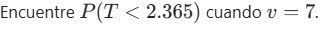

::: {.callout-tip collapse="true"}
## Mostrar solución inciso a

Se desea encontrar la probabilidad:

$$P(T < 2.365) \quad \text{cuando } v = 7$$

Buscando en la tabla de la distribución $t$ de Student con $7$ grados de libertad, el valor crítico $2.365$ deja un área de $0.025$ en la cola derecha, es decir:

$$P(T > 2.365) = 0.025$$

Por la propiedad del complemento, la probabilidad acumulada hacia la izquierda es:

$$P(T < 2.365) = 1 - P(T > 2.365)$$

$$P(T < 2.365) = 1 - 0.025 = 0.975$$

------------------------------------------------------------------------

**Resultado**

$$\boxed{P(T < 2.365) = 0.975}$$
:::

**B.** 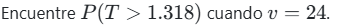

::: {.callout-tip collapse="true"}
## Mostrar solución inciso b

Se desea encontrar la probabilidad:

$$P(T > 1.318) \quad \text{cuando } v = 24$$

Buscando directamente en la tabla de la distribución $t$ de Student en la fila de $24$ grados de libertad, observamos qué columna corresponde al valor crítico $1.318$:

$$P(T > 1.318) = 0.10$$

------------------------------------------------------------------------

**Resultado**

$$\boxed{P(T > 1.318) = 0.10}$$
:::

**C.** 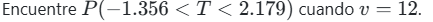

::: {.callout-tip collapse="true"}
## Mostrar solución inciso c

Se desea encontrar la probabilidad del intervalo:

$$P(-1.356 < T < 2.179) \quad \text{cuando } v = 12$$

Esta probabilidad se calcula restando las áreas de las colas externas:

$$P(-1.356 < T < 2.179) = 1 - P(T < -1.356) - P(T > 2.179)$$

Por la simetría de la distribución $t$ de Student, sabemos que:

$$P(T < -1.356) = P(T > 1.356)$$

Buscando en la tabla con $v = 12$ grados de libertad para ambos valores críticos: \* Para $t = 1.356$, el área a la derecha es $0.10$. \* Para $t = 2.179$, el área a la derecha es $0.025$.

Sustituyendo en la ecuación:

$$P(-1.356 < T < 2.179) = 1 - 0.10 - 0.025 = 0.875$$

------------------------------------------------------------------------

**Resultado**

$$\boxed{P(-1.356 < T < 2.179) = 0.875}$$
:::

**D.** 

::: {.callout-tip collapse="true"}
## Mostrar solución inciso d

Se desea encontrar la probabilidad:

$$P(T > -2.567) \quad \text{cuando } v = 17$$

Por la simetría de la distribución, el área a la derecha de un valor negativo es equivalente al área a la izquierda de su contraparte positiva:

$$P(T > -2.567) = P(T < 2.567)$$

Usando la propiedad del complemento:

$$P(T < 2.567) = 1 - P(T > 2.567)$$

Buscando en la tabla con $v = 17$ grados de libertad, para el valor $2.567$ le corresponde un área a la derecha de $0.01$:

$$P(T > -2.567) = 1 - 0.01 = 0.99$$

------------------------------------------------------------------------

**Resultado**

$$\boxed{P(T > -2.567) = 0.99}$$
:::

**Grafica**

## Gráfica Interactiva

```{r}
library(shiny)
library(plotly)

# Panel con 4 sliders independientes para controlar los grados de libertad (v)
fluidRow(
  column(3,
    sliderInput("v_t_btn_a", "v - Inciso a (t < 2.365):", min = 2, max = 35, value = 7, step = 1)
  ),
  column(3,
    sliderInput("v_t_btn_b", "v - Inciso b (t > 1.318):", min = 2, max = 35, value = 24, step = 1)
  ),
  column(3,
    sliderInput("v_t_btn_c", "v - Inciso c (-1.356 < T < 2.179):", min = 2, max = 35, value = 12, step = 1)
  ),
  column(3,
    sliderInput("v_t_btn_d", "v - Inciso d (t > -2.567):", min = 2, max = 35, value = 17, step = 1)
  )
)

plotlyOutput("grafica_t_botones_visibilidad", height = "500px")
```

```{r}
#| context: server

library(plotly)

output$grafica_t_botones_visibilidad <- renderPlotly({

  # Captura dinámica de los sliders
  v_a <- input$v_t_btn_a
  v_b <- input$v_t_btn_b
  v_c <- input$v_t_btn_c
  v_d <- input$v_t_btn_d

  # Eje X común simétrico para la t de Student
  x <- seq(-4.5, 4.5, length.out = 1000)
  p <- plot_ly()

  # Cada inciso genera exactamente 2 elementos en orden correlativo: (1) Línea y (2) Área sombreada
  
  # -------------------------------------------------------------------
  # 1. INCISO a: P(T < 2.365) [Elementos 1 y 2]
  # -------------------------------------------------------------------
  y_a <- dt(x, df = v_a)
  xa_col <- x[x <= 2.365]
  ya_col <- y_a[x <= 2.365]
  
  p <- p %>%
    add_lines(x = x, y = y_a, name = paste0("Inciso a (v = ", v_a, ")"), line = list(color = "#f8766d", width = 2.5)) %>%
    add_ribbons(x = xa_col, ymin = 0, ymax = ya_col, name = "Área a: P(T < 2.365)", fillcolor = "rgba(248, 118, 109, 0.25)", line = list(color = "transparent"))

  # -------------------------------------------------------------------
  # 2. INCISO b: P(T > 1.318) [Elementos 3 y 4]
  # -------------------------------------------------------------------
  y_b <- dt(x, df = v_b)
  xb_col <- x[x >= 1.318]
  yb_col <- y_b[x >= 1.318]
  
  p <- p %>%
    add_lines(x = x, y = y_b, name = paste0("Inciso b (v = ", v_b, ")"), line = list(color = "#00ba38", width = 2.5)) %>%
    add_ribbons(x = xb_col, ymin = 0, ymax = yb_col, name = "Área b: P(T > 1.318)", fillcolor = "rgba(0, 186, 56, 0.25)", line = list(color = "transparent"))

  # -------------------------------------------------------------------
  # 3. INCISO c: P(-1.356 < T < 2.179) [Elementos 5 y 6]
  # -------------------------------------------------------------------
  y_c <- dt(x, df = v_c)
  xc_col <- x[x >= -1.356 & x <= 2.179]
  yc_col <- y_c[x >= -1.356 & x <= 2.179]
  
  p <- p %>%
    add_lines(x = x, y = y_c, name = paste0("Inciso c (v = ", v_c, ")"), line = list(color = "#619cff", width = 2.5)) %>%
    add_ribbons(x = xc_col, ymin = 0, ymax = yc_col, name = "Área c: P(-1.356 < T < 2.179)", fillcolor = "rgba(97, 156, 255, 0.25)", line = list(color = "transparent"))

  # -------------------------------------------------------------------
  # 4. INCISO d: P(T > -2.567) [Elementos 7 y 8]
  # -------------------------------------------------------------------
  y_d <- dt(x, df = v_d)
  xd_col <- x[x >= -2.567]
  yd_col <- y_d[x >= -2.567]
  
  p <- p %>%
    add_lines(x = x, y = y_d, name = paste0("Inciso d (v = ", v_d, ")"), line = list(color = "#b359f4", width = 2.5)) %>%
    add_ribbons(x = xd_col, ymin = 0, ymax = yd_col, name = "Área d: P(T > -2.567)", fillcolor = "rgba(179, 89, 244, 0.25)", line = list(color = "transparent"))

  # -------------------------------------------------------------------
  # CONFIGURACIÓN DE BOTONES INTERACTIVOS (updatemenus)
  # -------------------------------------------------------------------
  # Controlamos qué pares de trazos (línea + sombra) se muestran (TRUE/FALSE)
  botones_visibilidad <- list(
    list(
      type = "buttons",
      direction = "right",
      x = 0.5,
      y = -0.15,
      xanchor = "center",
      yanchor = "top",
      pad = list(r = 10, t = 10),
      buttons = list(
        list(
          method = "restyle",
          args = list("visible", list(TRUE, TRUE, TRUE, TRUE, TRUE, TRUE, TRUE, TRUE)),
          label = "Mostrar Todas"
        ),
        list(
          method = "restyle",
          args = list("visible", list(TRUE, TRUE, FALSE, FALSE, FALSE, FALSE, FALSE, FALSE)),
          label = "Solo Inciso a"
        ),
        list(
          method = "restyle",
          args = list("visible", list(FALSE, FALSE, TRUE, TRUE, FALSE, FALSE, FALSE, FALSE)),
          label = "Solo Inciso b"
        ),
        list(
          method = "restyle",
          args = list("visible", list(FALSE, FALSE, FALSE, FALSE, TRUE, TRUE, FALSE, FALSE)),
          label = "Solo Inciso c"
        ),
        list(
          method = "restyle",
          args = list("visible", list(FALSE, FALSE, FALSE, FALSE, FALSE, FALSE, TRUE, TRUE)),
          label = "Solo Inciso d"
        )
      )
    )
  )

  # -------------------------------------------------------------------
  # DISEÑO FINAL DEL GRÁFICO
  # -------------------------------------------------------------------
  p %>%
    layout(
      title = "<b>Distribución t-Student Interactiva con Botones</b><br>Usa los botones inferiores para aislar preguntas o compararlas todas",
      xaxis = list(title = "Valor de t", range = c(-4.3, 4.3), gridcolor = "#eaeaea", zeroline = TRUE, zerolinecolor = "#cccccc"),
      yaxis = list(title = "Densidad", range = c(0, 0.42), gridcolor = "#eaeaea", zeroline = FALSE),
      plot_bgcolor = "white",
      paper_bgcolor = "white",
      updatemenus = botones_visibilidad,
      hovermode = "x unified"
    )
})
```

<br>

**Ejercicio 8.49**

**A.** 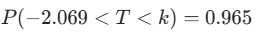

::: {.callout-tip collapse="true"}
## Mostrar solución inciso a

Se desea encontrar el valor de $k$ tal que:

$$P(-2.069 < T < k) = 0.965 \quad \text{cuando } v = 23$$

Buscando en la tabla de la distribución $t$ con $23$ grados de libertad, el valor de corte $-2.069$ acumula una probabilidad en la cola izquierda de:

$$P(T < -2.069) = 0.025$$

Sumamos la probabilidad del intervalo para conocer el área total acumulada hacia la izquierda del punto $k$:

$$P(T < k) = 0.025 + 0.965 = 0.990$$

Por complemento, la cola derecha correspondiente es $\alpha = 1 - 0.990 = 0.010$. Ubicamos dicha columna en la tabla para $v = 23$:

$$k = 2.500$$

------------------------------------------------------------------------

**Resultado**

$$\boxed{k = 2.500}$$
:::

**B.** 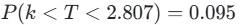

::: {.callout-tip collapse="true"}
## Mostrar solución inciso b

Se desea encontrar el valor de $k$ tal que:

$$P(k < T < 2.807) = 0.095 \quad \text{cuando } v = 23$$

Buscando en la tabla con $23$ grados de libertad, determinamos el área que queda en la cola derecha del valor extremo $2.807$:

$$P(T > 2.807) = 0.005$$

El área total a la derecha del punto desconocido $k$ es la suma del intervalo dado más esta pequeña cola extrema:

$$P(T > k) = 0.095 + 0.005 = 0.100$$

Buscamos en la tabla el valor crítico que deja un área de $\alpha = 0.100$ a su derecha con $v = 23$:

$$k = 1.319$$

------------------------------------------------------------------------

**Resultado**

$$\boxed{k = 1.319}$$
:::

**C.** 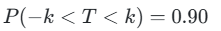

::: {.callout-tip collapse="true"}
## Mostrar solución inciso c

Se desea encontrar el valor de $k$ tal que:

$$P(-k < T < k) = 0.90 \quad \text{cuando } v = 23$$

Al ser un intervalo simétrico centrado en cero, el área que queda distribuida por fuera de ambas fronteras (las dos colas juntas) es:

$$\alpha_{\text{total}} = 1 - 0.90 = 0.10$$

Dividimos de manera equitativa el área externa entre los dos extremos de la campana:

$$\text{Área de la cola derecha} = \frac{0.10}{2} = 0.050$$

Buscamos en la fila de $v = 23$ el valor crítico correspondiente a un área superior de $\alpha = 0.050$:

$$k = 1.714$$

------------------------------------------------------------------------

**Resultado**

$$\boxed{k = 1.714}$$
:::

------------------------------------------------------------------------

**Grafica**

## Gráfica Interactiva

```{r}
library(shiny)
library(plotly)

# Sliders para controlar v de forma independiente en cada inciso
fluidRow(
  column(4,
    sliderInput("v_49_a", "v - Inciso a (-2.069 < T < 2.500):", min = 2, max = 35, value = 23, step = 1)
  ),
  column(4,
    sliderInput("v_49_b", "v - Inciso b (1.319 < T < 2.807):", min = 2, max = 35, value = 23, step = 1)
  ),
  column(4,
    sliderInput("v_49_c", "v - Inciso c (-1.714 < T < 1.714):", min = 2, max = 35, value = 23, step = 1)
  )
)

plotlyOutput("grafica_t_ejercicio849", height = "500px")
```

```{r}
#| context: server

library(plotly)

output$grafica_t_ejercicio849 <- renderPlotly({

  v_a <- input$v_49_a
  v_b <- input$v_49_b
  v_c <- input$v_49_c

  x <- seq(-4.5, 4.5, length.out = 1000)
  p <- plot_ly()

  # 1. INCISO a: P(-2.069 < T < 2.500) [Elementos 1 y 2]
  y_a <- dt(x, df = v_a)
  x_col_a <- x[x >= -2.069 & x <= 2.500]
  y_col_a <- y_a[x >= -2.069 & x <= 2.500]
  
  p <- p %>%
    add_lines(x = x, y = y_a, name = paste0("Inciso a (v = ", v_a, ")"), line = list(color = "#f8766d", width = 3)) %>%
    add_ribbons(x = x_col_a, ymin = 0, ymax = y_col_a, name = "Sombreado a (P=0.965)", 
                fillcolor = "rgba(248, 118, 109, 0.3)", line = list(color = "transparent"))

  # 2. INCISO b: P(1.319 < T < 2.807) [Elementos 3 y 4]
  y_b <- dt(x, df = v_b)
  x_col_b <- x[x >= 1.319 & x <= 2.807]
  y_col_b <- y_b[x >= 1.319 & x <= 2.807]
  
  p <- p %>%
    add_lines(x = x, y = y_b, name = paste0("Inciso b (v = ", v_b, ")"), line = list(color = "#00ba38", width = 3)) %>%
    add_ribbons(x = x_col_b, ymin = 0, ymax = y_col_b, name = "Sombreado b (P=0.095)", 
                fillcolor = "rgba(0, 186, 56, 0.3)", line = list(color = "transparent"))

  # 3. INCISO c: P(-1.714 < T < 1.714) [Elementos 5 y 6]
  y_c <- dt(x, df = v_c)
  x_col_c <- x[x >= -1.714 & x <= 1.714]
  y_col_c <- y_c[x >= -1.714 & x <= 1.714]
  
  p <- p %>%
    add_lines(x = x, y = y_c, name = paste0("Inciso c (v = ", v_c, ")"), line = list(color = "#619cff", width = 3)) %>%
    add_ribbons(x = x_col_c, ymin = 0, ymax = y_col_c, name = "Sombreado c (P=0.90)", 
                fillcolor = "rgba(97, 156, 255, 0.3)", line = list(color = "transparent"))

  # CONFIGURACIÓN DE BOTONES
  p <- p %>% layout(
    updatemenus = list(
      list(
        type = "buttons", direction = "right", x = 0.5, y = -0.15, xanchor = "center",
        buttons = list(
          list(method = "restyle", args = list("visible", list(T, T, T, T, T, T)), label = "Todas"),
          list(method = "restyle", args = list("visible", list(T, T, F, F, F, F)), label = "Solo a"),
          list(method = "restyle", args = list("visible", list(F, F, T, T, F, F)), label = "Solo b"),
          list(method = "restyle", args = list("visible", list(F, F, F, F, T, T)), label = "Solo c")
        )
      )
    ),
    title = "<b>Simulación Ejercicio 8.49</b><br>Áreas sombreadas basadas en los valores de k calculados",
    xaxis = list(title = "t", range = c(-4.3, 4.3), gridcolor = "#f0f0f0"),
    yaxis = list(title = "Densidad", range = c(0, 0.42), gridcolor = "#f0f0f0"),
    plot_bgcolor = "white", paper_bgcolor = "white", hovermode = "x unified"
  )
})
```

<br>

# .Distribución F de Fisher

**Ejercicio 8.53**

**A.** 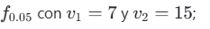

::: {.callout-tip collapse="true"}
## Mostrar solución inciso a

Se desea encontrar el valor crítico de la distribución $F$ tal que:

$$f_{0.05} \quad \text{cuando } v_1 = 7 \text{ y } v_2 = 15$$

Buscando directamente en la tabla de la distribución $F$ para un área de cola derecha de $\alpha = 0.05$, con $7$ grados de libertad en el numerador ($v_1$) y $15$ grados de libertad en el denominador ($v_2$):

$$f_{0.05}(7, 15) = 2.71$$

------------------------------------------------------------------------

**Resultado**

$$\boxed{f_{0.05} = 2.71}$$
:::

**B.** 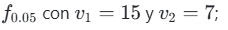

::: {.callout-tip collapse="true"}
## Mostrar solución inciso b

Se desea encontrar el valor crítico de la distribución $F$ tal que:

$$f_{0.05} \quad \text{cuando } v_1 = 15 \text{ y } v_2 = 7$$

Buscando en la tabla de la distribución $F$ para un área de cola derecha de $\alpha = 0.05$, con $15$ grados de libertad en el numerador ($v_1$) y $7$ grados de libertad en el denominador ($v_2$):

$$f_{0.05}(15, 7) = 3.51$$

------------------------------------------------------------------------

**Resultado**

$$\boxed{f_{0.05} = 3.51}$$
:::

**C.** 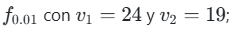

::: {.callout-tip collapse="true"}
## Mostrar solución inciso c

Se desea encontrar el valor crítico de la distribución $F$ tal que:

$$f_{0.01} \quad \text{cuando } v_1 = 24 \text{ y } v_2 = 19$$

Buscando en la tabla de la distribución $F$ para un área de cola derecha de $\alpha = 0.01$, con $24$ grados de libertad en el numerador ($v_1$) y $19$ grados de libertad en el denominador ($v_2$):

$$f_{0.01}(24, 19) = 2.92$$

------------------------------------------------------------------------

**Resultado**

$$\boxed{f_{0.01} = 2.92}$$
:::

**D.** 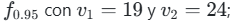

::: {.callout-tip collapse="true"}
## Mostrar solución inciso d

Se desea encontrar el valor crítico de la distribución $F$ tal que:

$$f_{0.95} \quad \text{cuando } v_1 = 19 \text{ y } v_2 = 24$$

Para encontrar valores críticos del extremo izquierdo ($f_{0.95}$), aplicamos la propiedad del recíproco invirtiendo los grados de libertad:

$$f_{1-\alpha}(v_1, v_2) = \frac{1}{f_{\alpha}(v_2, v_1)}$$

$$f_{0.95}(19, 24) = \frac{1}{f_{0.05}(24, 19)}$$

Buscamos en la tabla el valor de $f_{0.05}(24, 19) = 2.11$:

$$f_{0.95}(19, 24) = \frac{1}{2.11} \approx 0.474$$

------------------------------------------------------------------------

**Resultado**

$$\boxed{f_{0.95} = 0.474}$$
:::

**E.** 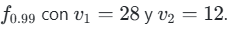

::: {.callout-tip collapse="true"}
## Mostrar solución inciso e

Se desea encontrar el valor crítico de la distribución $F$ tal que:

$$f_{0.99} \quad \text{cuando } v_1 = 28 \text{ y } v_2 = 12$$

Aplicamos la propiedad del recíproco para transformar el área al extremo derecho invirtiendo los grados de libertad:

$$f_{0.99}(28, 12) = \frac{1}{f_{0.01}(12, 28)}$$

Buscamos en la tabla el valor correspondiente a $f_{0.01}(12, 28) = 2.90$:

$$f_{0.99}(28, 12) = \frac{1}{2.90} \approx 0.345$$

------------------------------------------------------------------------

**Resultado**

$$\boxed{f_{0.99} = 0.345}$$
:::

------------------------------------------------------------------------

**Grafica**

## Gráfica Interactiva 

```{r}
library(shiny)
library(plotly)

x <- seq(0.001, 5.0, length.out = 1000)

p <- plot_ly() %>%
  # Inciso a: v1=7, v2=15 (f0.05 = 2.71)
  add_lines(x = x, y = df(x, 7, 15), name = "v1=7, v2=15 (a)", line = list(color = "#f8766d", width = 2)) %>%
  add_ribbons(x = x[x >= 2.71], ymin = 0, ymax = df(x[x >= 2.71], 7, 15), name = "f0.05 = 2.71", fillcolor = "rgba(248, 118, 109, 0.25)", line = list(color = "transparent")) %>%

  # Inciso b: v1=15, v2=7 (f0.05 = 3.51)
  add_lines(x = x, y = df(x, 15, 7), name = "v1=15, v2=7 (b)", line = list(color = "#7cae00", width = 2)) %>%
  add_ribbons(x = x[x >= 3.51], ymin = 0, ymax = df(x[x >= 3.51], 15, 7), name = "f0.05 = 3.51", fillcolor = "rgba(124, 174, 0, 0.25)", line = list(color = "transparent")) %>%

  # Inciso c: v1=24, v2=19 (f0.01 = 2.92)
  add_lines(x = x, y = df(x, 24, 19), name = "v1=24, v2=19 (c)", line = list(color = "#00be67", width = 2)) %>%
  add_ribbons(x = x[x >= 2.92], ymin = 0, ymax = df(x[x >= 2.92], 24, 19), name = "f0.01 = 2.92", fillcolor = "rgba(0, 190, 103, 0.25)", line = list(color = "transparent")) %>%

  # Inciso d: v1=19, v2=24 (f0.95 = 0.473)
  add_lines(x = x, y = df(x, 19, 24), name = "v1=19, v2=24 (d)", line = list(color = "#00bfc4", width = 2)) %>%
  add_ribbons(x = x[x <= 0.473], ymin = 0, ymax = df(x[x <= 0.473], 19, 24), name = "f0.95 = 0.473", fillcolor = "rgba(0, 191, 196, 0.25)", line = list(color = "transparent")) %>%

  # Inciso e: v1=28, v2=12 (f0.99 = 0.345)
  add_lines(x = x, y = df(x, 28, 12), name = "v1=28, v2=12 (e)", line = list(color = "#c77cff", width = 2)) %>%
  add_ribbons(x = x[x <= 0.345], ymin = 0, ymax = df(x[x <= 0.345], 28, 12), name = "f0.99 = 0.345", fillcolor = "rgba(199, 124, 255, 0.25)", line = list(color = "transparent")) %>%

  layout(
    title = "Familia de curvas de la distribución F",
    xaxis = list(title = "x", range = c(0, 5), gridcolor = "#eaeaea"),
    yaxis = list(title = "Densidad", gridcolor = "#eaeaea"),
    plot_bgcolor = "white",
    paper_bgcolor = "white",
    hovermode = "x unified",
    updatemenus = list(
      list(
        type = "buttons",
        direction = "right",
        x = 0.5,
        y = -0.15,
        xanchor = "center",
        yanchor = "top",
        buttons = list(
          list(method = "update", label = "Mostrar Todas", args = list(list(visible = list(T, T, T, T, T, T, T, T, T, T)))),
          list(method = "update", label = "Inciso a",     args = list(list(visible = list(T, T, F, F, F, F, F, F, F, F)))),
          list(method = "update", label = "Inciso b",     args = list(list(visible = list(F, F, T, T, F, F, F, F, F, F)))),
          list(method = "update", label = "Inciso c",     args = list(list(visible = list(F, F, F, F, T, T, F, F, F, F)))),
          list(method = "update", label = "Inciso d",     args = list(list(visible = list(F, F, F, F, F, F, T, T, F, F)))),
          list(method = "update", label = "Inciso e",     args = list(list(visible = list(F, F, F, F, F, F, F, F, T, T))))
        )
      )
    )
  )

p
```

# .Teorema del limite central


**1. Concepto del Teorema del Límite Central}**

El Teorema del Límite Central establece que si se toma una muestra aleatoria de tamaño $n$ de cualquier población con media $\mu$ y desviación estándar $\sigma$ finitas, la distribución de la media muestral $\bar{X}$ se aproxima a una \textbf{distribución normal} a medida que el tamaño de la muestra aumenta ($n \to \infty$).

Si las variables aleatorias $X_1, X_2, \dots, X_n$ son independientes e idénticamente distribuidas (i.i.d.), entonces para un $n$ suficientemente grande, la suma de las variables o su promedio se distribuyen de la siguiente manera:

$$\bar{X} \sim N\left(\mu_{\bar{x}}, \sigma_{\bar{x}}\right)$$

Donde los parámetros de la distribución de medias muestrales son:

\begin{itemize}
    \item \textbf{Media de la distribución muestral:} 
    $$\mu_{\bar{x}} = \mu$$
    
    \item \textbf{Error estándar (desviación estándar de la media):} 
    $$\sigma_{\bar{x}} = \frac{\sigma}{\sqrt{n}}$$
\end{itemize}

Para realizar cálculos de probabilidad e inferencia estadística, se utiliza la variable estandarizada $Z$:

$$Z = \frac{\bar{X} - \mu}{\frac{\sigma}{\sqrt{n}}} \sim N(0, 1)$$

---

**Grafica**

## Gráfica Interactiva 

```{r}
library(shiny)
library(ggplot2)
library(plotly)

sidebarLayout(

  # =====================================
  # PANEL IZQUIERDO
  # =====================================

  sidebarPanel(

    width = 3,

    selectInput(
      "grafica_tcl",
      "Distribución:",

      choices = c(
        "Binomial original",
        "Medias muestrales Binomial",
        "Poisson original",
        "Medias muestrales Poisson",
        "Hipergeométrica original",
        "Medias muestrales Hipergeométrica"
      )
    ),

    # =====================================
    # BINOMIAL
    # =====================================

    conditionalPanel(

      condition = "
      input.grafica_tcl == 'Binomial original' ||
      input.grafica_tcl == 'Medias muestrales Binomial'
      ",

      numericInput(
        "size_bin",
        "Ensayos (n):",
        value = 10,
        min = 1
      ),

      sliderInput(
        "p_bin",
        "Probabilidad (p):",
        min = 0.01,
        max = 0.99,
        value = 0.30,
        step = 0.01
      )
    ),

    # =====================================
    # POISSON
    # =====================================

    conditionalPanel(

      condition = "
      input.grafica_tcl == 'Poisson original' ||
      input.grafica_tcl == 'Medias muestrales Poisson'
      ",

      sliderInput(
        "lambda_pois",
        "Lambda:",
        min = 1,
        max = 20,
        value = 4,
        step = 0.1
      )
    ),

    # =====================================
    # HIPERGEOMÉTRICA
    # =====================================

    conditionalPanel(

      condition = "
      input.grafica_tcl == 'Hipergeométrica original' ||
      input.grafica_tcl == 'Medias muestrales Hipergeométrica'
      ",

      numericInput(
        "Npop",
        "Tamaño población:",
        value = 1000,
        min = 100
      ),

      numericInput(
        "K",
        "Éxitos población:",
        value = 300,
        min = 1
      ),

      numericInput(
        "m",
        "Tamaño muestra:",
        value = 20,
        min = 1
      )
    ),

    hr(),

    numericInput(
      "n_tcl",
      "Tamaño de muestra (TCL):",
      value = 30,
      min = 2
    ),

    numericInput(
      "Nsim",
      "Número de simulaciones:",
      value = 10000,
      min = 100
    ),

    br(),

    actionButton(
      "simular",
      "Simular"
    )
  ),

  # =====================================
  # PANEL DERECHO
  # =====================================

  mainPanel(

    width = 9,

    h3(
      textOutput("titulo")
    ),

    plotlyOutput(
      "grafica_TCL",
      height = "650px"
    ),

    br(),

    htmlOutput("resultado")
  )
)
```

```{r}
#| context: server

library(ggplot2)
library(plotly)

# =====================================
# DATOS
# =====================================

datos_simulados <- eventReactive(input$simular, {

  set.seed(123)

  N <- 100000

  # ---------------------------------
  # BINOMIAL
  # ---------------------------------

  pob_bin <- rbinom(
    N,
    size = input$size_bin,
    prob = input$p_bin
  )

  medias_bin <- replicate(
    input$Nsim,

    mean(
      rbinom(
        input$n_tcl,
        size = input$size_bin,
        prob = input$p_bin
      )
    )
  )

  # ---------------------------------
  # POISSON
  # ---------------------------------

  pob_pois <- rpois(
    N,
    lambda = input$lambda_pois
  )

  medias_pois <- replicate(
    input$Nsim,

    mean(
      rpois(
        input$n_tcl,
        lambda = input$lambda_pois
      )
    )
  )

  # ---------------------------------
  # HIPERGEOMÉTRICA
  # ---------------------------------

  pob_hip <- rhyper(
    N,
    m = input$K,
    n = input$Npop - input$K,
    k = input$m
  )

  medias_hip <- replicate(
    input$Nsim,

    mean(
      rhyper(
        input$n_tcl,
        m = input$K,
        n = input$Npop - input$K,
        k = input$m
      )
    )
  )

  list(

    pob_bin = pob_bin,
    medias_bin = medias_bin,

    pob_pois = pob_pois,
    medias_pois = medias_pois,

    pob_hip = pob_hip,
    medias_hip = medias_hip
  )
})

# =====================================
# TITULO
# =====================================

output$titulo <- renderText({

  input$grafica_tcl

})

# =====================================
# RESULTADOS
# =====================================

output$resultado <- renderUI({

  datos <- datos_simulados()

  req(datos)

  if(input$grafica_tcl == "Binomial original"){

    valores <- datos$pob_bin

  }

  else if(input$grafica_tcl == "Medias muestrales Binomial"){

    valores <- datos$medias_bin

  }

  else if(input$grafica_tcl == "Poisson original"){

    valores <- datos$pob_pois

  }

  else if(input$grafica_tcl == "Medias muestrales Poisson"){

    valores <- datos$medias_pois

  }

  else if(input$grafica_tcl == "Hipergeométrica original"){

    valores <- datos$pob_hip

  }

  else{

    valores <- datos$medias_hip

  }

  media <- mean(valores)
  desviacion <- sd(valores)

  HTML(paste0(

    "<div style='
    background:#f5f5f5;
    padding:20px;
    border-radius:10px;
    border:1px solid #d9d9d9;
    font-size:16px;
    '>",

    "<h4><b>Resultados</b></h4>",

    "<b>Media:</b> ",
    round(media,4),

    "<br><br>",

    "<b>Desviación estándar:</b> ",
    round(desviacion,4),

    "<br><br>",

    "<b>Simulaciones:</b> ",
    input$Nsim,

    "</div>"
  ))
})

# =====================================
# GRAFICA
# =====================================

output$grafica_TCL <- renderPlotly({

  req(input$simular)

  datos <- datos_simulados()

  # =====================================
  # SELECCIÓN
  # =====================================

  if(input$grafica_tcl == "Binomial original"){

    valores <- datos$pob_bin

    titulo <- "Distribución Binomial Original"

    color_barra <- "#9ACD32"

    curva <- FALSE
  }

  else if(input$grafica_tcl == "Medias muestrales Binomial"){

    valores <- datos$medias_bin

    titulo <- "Distribución de las Medias Muestrales"

    color_barra <- "#9ACD32"

    curva <- TRUE
  }

  else if(input$grafica_tcl == "Poisson original"){

    valores <- datos$pob_pois

    titulo <- "Distribución Poisson Original"

    color_barra <- "#ff33cc"

    curva <- FALSE
  }

  else if(input$grafica_tcl == "Medias muestrales Poisson"){

    valores <- datos$medias_pois

    titulo <- "Distribución de las Medias Muestrales"

    color_barra <- "#ff66cc"

    curva <- TRUE
  }

  else if(input$grafica_tcl == "Hipergeométrica original"){

    valores <- datos$pob_hip

    titulo <- "Distribución Hipergeométrica Original"

    color_barra <- "#b3b3cc"

    curva <- FALSE
  }

  else{

    valores <- datos$medias_hip

    titulo <- "Distribución de las Medias Muestrales"

    color_barra <- "#b3b3cc"

    curva <- TRUE
  }

  df <- data.frame(x = valores)

  # =====================================
  # GGPLOT
  # =====================================

  g <- ggplot(df, aes(x = x)) +

    geom_histogram(

      aes(y = after_stat(density)),

      bins = 25,

      fill = color_barra,

      color = "white",

      linewidth = 0.3
    ) +

    labs(

      title = titulo,

      x = "Valores",

      y = "Densidad"
    ) +

    theme_minimal(base_size = 14)

  # =====================================
  # CURVA NORMAL
  # =====================================

  if(curva == TRUE){

    media <- mean(valores)

    desviacion <- sd(valores)

    g <- g +

      stat_function(

        fun = dnorm,

        args = list(
          mean = media,
          sd = desviacion
        ),

        color = "blue",

        linewidth = 1,

        linetype = "dashed"
      )
  }

  # =====================================
  # PLOTLY
  # =====================================

  ggplotly(g)

})
```


